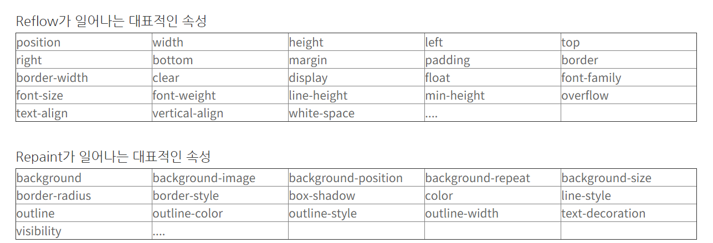

 DOM - BOM 이란?
===

기본적인 브라우저 원리 : 원하는 정보를 가진 서버에 요청을하여 해당하는 웹문서를 받아 브라우저의 렌더링엔진은 웹문서를 로드한 후, 브라우저가 이해할수있는 구조로 메모리에 적재한다. 

### 0. window 객체 : 자바스크립트의 최상위객체이자 전역객체이면서 모든 객체가 소속된 '브라우저 객체'
Dom, Bom, JS core가 속해있다. 

### 1. BOM :  브라우저와 관련된 객체들의 집합  
웹페이지의 내용을 제외한 브라우저의 각종 요소들을 객체화  
브라우저의 버튼 URL 주소 입력창 타이틀 바 등 웹브라우저 윈도 및 웹페이지의 일부분을 제어할 수 있게 뜸한 윈도 객체모델이다.  
특징 : 자바스크립트가 브라우저와 소통하기 위한 모델

ex) bom객체 안의 screen 객체 (웹 브라우저의 화면이 아니라 운영체제 화면의 속성을 가지는 객체)  
문서와 관련이 있는 것이 아닌 브라우저 화면과 관련이 있다.

```html
<!-- screen.html --> <!DOCTYPE html> 
<html>
<head> 
<meta charset="UTF-8"> 
<title>screen</title> 
<script type="text/javascript">
 var output = ''; for (var i in screen) 
{ output += '※ ' + i + ' : ' + screen[i] + '\n'; } 
alert(output); 
</script> 
</head> 
<body> 
</body> 
</html>

출처: https://gangzzang.tistory.com/entry/자바스크립트JavaScript-브라우저-객체-모델Browser-Object-Model [갱짱.study]
```

### 2. DOM : 웹페이지를 (자바스크립트로) 제어하기 위한 객체 모델 => 브라우저가 웹문서를 이해할수있게 구성된 것

=> dom은 서버를 통해 받아온 문서(index.html)을 객체로 만들어 이를 js를 통해 제어할수있게 하는 것이라 생각

Dom의 기능
1) HTML 문서에 대한 모델 구성 
2) HTML 문서 내의 각 요소에 접근 및 수정

ex)
```html
<!DOCTYPE html>
<html lang="en">
<head>
    <meta charset="UTF-8">
    <title>Title</title>
</head>
<body>
	<div class="a"> 운영체제보안 행복해요 </div>
<script type="text/javascript"> 
	document.querySelector('.a').innerHTML="사실 힘들어"
 </script>
</body>
</html>
```
이를 실행 할 경우 Dom으로 인해 문서가 객체화 될것이고 js를 통해 객체에 접근하여 문서의 내용을 바꿔주는 역할을 한다. 

정리하자면  
BOM은 브라우저 창 안의 속성 (문서외에 나머지와 관련)
DOM은 브라우저 창 안의 웹문서 내용 (문서와 관련)


### 3. Reflow :Render Tree와 각 요소들의 크기와 위치를 다시 계산하는 것
### Repaint : 이 Reflow 과정이 끝난 후 재 생성된 렌더 트리를 다시 그리게 되는데 렌더링 트리를 화면에 픽셀로 변환

### 중요) DOM이 화면을 변화시키는가? => 변화시킨다 => reflow 발생(Dom트리 변화=>CSSOM변화 =>Render tree 변화) => repaint를 통해 브라우저 출력
### 중요) DOM이 화면을 변화시키는가? => 변화시킨다 => reflow 발생(CSSOM변화 => Render tree 변화)=> repaint를 통해 브라우저 출력

reflow 예시(레이아웃에 영향)
https://oyg0420.tistory.com/entry/%EB%B8%8C%EB%9D%BC%EC%9A%B0%EC%A0%80%EC%9D%98-Reflow-%EC%99%80-Repaint

1. 노드의 추가 또는 제거시
2. 요소의 위치 변경 시
3. 요소의 크기 변경 시 (margin, padding, border, width, height 등..)
4. 폰트나 텍스트 내용 변경과 이미지 크기 변경 시
5. 페이지 초기 랜더링 시 (최초 Layout 과정)
6. 윈도우 리사이징 시

```js
var el = document.getElementById('reflow-test');

el.style.padding = '8px';
el.style.width = '320px';
el.style.height = '240px';
// 3 번의 리플로우 발생

/////////
var el = document.getElementById('reflow-test');

el.style.cssText = 'padding: 8px; width: 320px; height: 240px;';
/* or */
el.className = 'changed';
// 1 번의 리플로우 발생
```
따라서 리플로우의 발생을 줄일수록 repaint(redraw)도 줄어 시간을 줄이게된다. 
```
하지만 무조건 Reflow가 일어나야 Repaint가 일어나는것은 아닙니다.   
background-color, visibility와 같이 레이아웃에는 영향을 주지 않는 스타일 속성이 변경되었을 때는 
Reflow를 수행할 필요가 없기 때문에 Repaint만 수행하게 됩니다.
출처: https://boxfoxs.tistory.com/408 [박스여우 - BoxFox]
```

아래는 각각 Reflow, Repaint가 일어나는 CSS 속성들 입니다. Reflow가 일어나면 Repaint는 필연적으로 일어나야 하기 때문에 가능하다면 Reflow가 발생하는 속성보다 Repaint 만 발생하는 속성을 사용하는것이 좋습니다.

 	 	 
또한 Reflow Repaint가 일어나지 않는 transform, opacitiy와 같은 속성도 있습니다. 따라서 left, right, width, height 보다 transform을, visibility/display 보다 opacitiy를 사용하는 것이 성능 개선에 도움이 됩니다.


출처: https://boxfoxs.tistory.com/408 [박스여우 - BoxFox]

### 4. Dom api ( DOM은 또한 W3C가 표준화한 여러 개의 API의 기반이 된다. )
=> 왜냐? Dom을 통해 js를 조작하여 html의 수정이 가능하게 하기 때문에 그 사이에 있는 DOM은 마치 api이기때문

```
이를 통해 가능한 것은  
  1) 새로운 HTML 요소나 속성을 추가할 수 있다.
  2) 존재하는 HTML 요소나 속성을 제거할 수 있다.
  3) HTML 문서의 모든 HTML 요소를 변경할 수 있다.
  4) HTML 문서의 모든 HTML 속성을 변경할 수 있다.
  5) HTML 문서의 모든 CSS 스타일을 변경할 수 있다.
  6) HTML 문서에 새로운 HTML 이벤트를 추가할 수 있다.
  7) HTML 문서의 모든 HTML 이벤트에 반응할 수 있다.
```
```
이를 사용하기 위해서는

1) 조작하고자하는 요소를 선택 또는 탐색한다.

2) 선택된 요소의 콘텐츠 또는 어트리뷰트를 조작한다.

```

### 4.1) 조작하고자하는 요소를 선택 또는 탐색한다.

1) document.getElementById(id)

2) document.querySelector(cssSelector)


```html
<body>
<p>abc</p>
<div class="x">def</div>
<span id="y">ghi</span>
 </body> 

 <script type="text/javascript">
	let x = document.querySelector('.x');   //조작요소 선택
	let y = document.getElementById('y');
	let abc = document.querySelector('p'); 

	abc.innerHTML="ABC"     //조작 (소문자에서 대문자로) 
	x.innerHTML="DEF";
	y.innerHTML = "GHI"
	 </script> 
```

//출처 : 
https://webclub.tistory.com/346
https://wonism.github.io/reflow-repaint/


### 5. 이벤트
onclick으로 바인딩 된 이벤트 핸들러 (여러개의 사용할경우 하나만 동작)
```js
btn.onclick = function() {
				alert("Button clicked 1");
			};
```

addEventListener로 바인딩 된 이벤트 핸들러 (여러개 사용해도 동작)
```js
btn.addEventListener("click", function() {
				alert("Button clicked 1");
			})
```

### 6. 이벤트 전파
#### 1) 이벤트 버블링
```html
<!DOCTYPE html>
<html>
	<body>
	<div class="one" style="background-color:red;height:150px">
		<div class="two" style="background-color:yellow;height:100px">
			<div class="three" style="background-color:green;  height:50px;">
			</div>
		</div>
	</div>
	
</body>
<script>
	var divs = document.querySelectorAll("div");
	console.log(divs[0]);   //div class="one" ~ div class="three"
	console.log(divs[1]);   //div class="two" ~ div class="three"
	console.log(divs[2]);   //div class="three" ~</div>

divs.forEach(function(div) {
	div.addEventListener("click", logEvent);        //모든 class에 click event를 걸어준다.
});
/*
	divs[0].addEventListener("click", logEvent);
	divs[1].addEventListener("click", logEvent);
	divs[2].addEventListener("click", logEvent);
 이것과 위 forEach 코드는 동일
*/

function logEvent(event) {
	console.log(event.currentTarget.className);
}

</script>
</html>

```
예를들어 
1) red인 부분을 클릭하면 window객체부터 아래로 내려가며 class="one"인 부분을 찾고 그 className인 one을 출력
2) yellow인 부분을 클릭하면 window객체부터 아래로 내려가며 class="one"인 부분을 지나 class="two"인 부분을 찾고 그 className인 two를 출력 후 위로 올라가면서 one도 출력
3) green인 부분을 클릭하면 window객체부터 아래로 내려가며 class="one,two"인 부분을 지나 class="three"인 부분을 찾고 그 className인 three를 출력 후 위로 올라가면서 two,one도 출력

이는 출력 기준이 capture = "false"일 때 이므로 버블링 상황이다. 

브라우저는 특정 화면 요소에서 이벤트가 발생했을 때 그 이벤트를 (해당 dom위치까지 찾고 다시 위로 ) 최상위에 있는 화면 요소까지 이벤트를 전파시킨다.

#### 2) 이벤트 캡쳐
특정 요소에서 이벤트가 발생했을 때 해당 이벤트가 더 하위의 요소들로 전달되어 가는 특성이다.

```js
var divs = document.querySelectorAll("div");
divs.forEach(function(div) {
	div.addEventListener("click", logEvent, true);
});

function logEvent(event) {
	console.log(event.currentTarget.className);
}
```
capture:true를 적용하면 이벤트 버블링과 반대 방향으로 탐색한다

```
정리
addEventListener 메소드의 세번째 매개변수에 true를 설정하면 캡처링으로 전파되는 이벤트를 캐치하고,
false 또는 미설정하면 버블링으로 전파되는 이벤트를 캐치한다.  
버블링과 캡처링은 둘 중에 하나만 발생하는 것이 아니라 캡처링부터 시작하여 버블링으로 종료한다는 것이다.
즉, 이벤트가 발생했을 때 캡처링과 버블링은 순차적으로 발생한다. (그림을 보니 확실히 이해가되었다.)
```

#### 3) 이벤트 버블링 캡쳐 막기 =>stopPropagation() 웹 API를 사용
원하는 출력 전에 stopPropagation() 을 코드로 작성하면 연결되어 계속 사용하지않고 이벤트 제어

### 7. event.stopPropagation() vs event.preventDefault() 
stopPropagation 메소드는 이벤트가 element로 전파되는 것을 막기 위한 함수이다.
preventDefault 메소드는 현재 이벤트의 기본 동작을 중지 하기 위해 사용한다. ex) a,input,textarea

```html
<a href="http://naver.com" id="link">네이버 홈으로 이동</a>
<script>
	document.querySelector('#link').addEventListener('click', function( e ){
		e.preventDefault();
	});
	// a 태그 클릭 시 링크값이 있어도 이동하지 않는다.
</script>
```
실제 클릭시 해당 페이지로 이동하지않는다.

출처: http://megaton111.cafe24.com/2015/04/30/preventdefault-%EC%99%80-stoppropagation-%EC%B0%A8%EC%9D%B4/


느낀점 
Dom이 왜 api라는건지 이해를 했다. (html과 js를 연결하여 필요에따라 제어하는 중간역할)  
이벤트 버블링과 캡쳐를 이해하고 둘다 일어나는 일이라는것을 이해했다.   
그러한 버블링 캡쳐를 막는 stopPropagation을 이해했다. 
